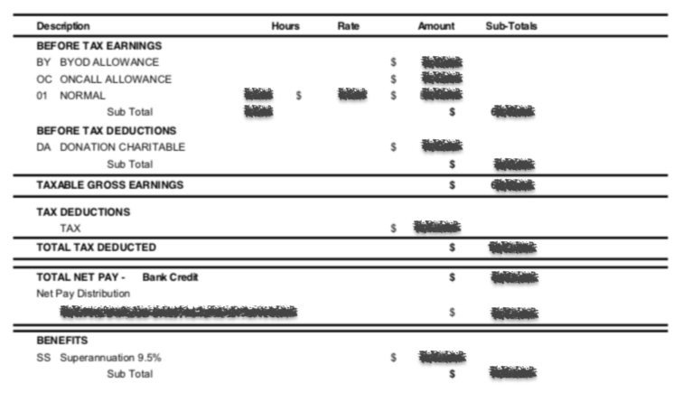

# Payslips To Text
Payslips to text is a simple script to analyse PDF payslips from Workday (or possibly other sources) and output interesting bits into columns.

This is useful primarily for multi-nationals to break down taxable earnings and other specifics on a monthly basis, so you can better calculate your taxes across different countries.

## Setup
    brew install pkg-config poppler
    pipenv shell && pipenv install

## Usage
 Simple usage to scan the whole directory for PDFs that might contain payslips.

    python payslips_to_text.py --input-dir ~/<your_payslips>
    Found 77 glob matches for PDFs to scan
    Found 22 valid payslip objects from 77 total files scanned.
    
    paid_on_date,donation,taxable_gross_earnings,total_tax_deducted,total_net_pay,superannuation
    15/10/19,11.11,"1,111.11","1,111.11","1,111.11",111.11
    15/02/19,11.11,"1,111.11","1,111.11","1,111.11",111.11
    15/03/19,11.11,"1,111.11","1,111.11","1,111.11",111.11
    15/04/19,11.11,"1,111.11","1,111.11","1,111.11",111.11
    ...

More options

    python payslips_to_text.py -h                     
    usage: payslips_to_text.py [-h] [-i INPUT_DIR] [-p PATTERN] [-o OUTPUT_FILE]
                           [-v]

    Convert PDFs of payslips into parsable CSV output.

    optional arguments:
    -h, --help            show this help message and exit
    -i INPUT_DIR, --input-dir INPUT_DIR
                        Location of PDF files containing payslip data.
                        Defaults to current directory.
    -p PATTERN, --pattern PATTERN
                        The input file names to match where payslip data
                        resides (defaults to *.pdf).
    -o OUTPUT_FILE, --output-file OUTPUT_FILE
                        The filename where output data will be written
                        (defaults to stdout).
    -v, --verbose         Display verbose debugging output.

## On parsing PDFs
PDF regexes are defined at the top of the script. If your input files are different, play with the regexes and/or fieldnames defined to suit your needs. The fields there match up to the `_FIELDNAMES` values defined for CSV output.

All other PDFs (ie Year End payslips) will be converted to text, but not saved for analysis.

The resulting parsed `pdftotext.PDF` object is quite literal:

    with open("./000788_000000270_15112019.pdf", "rb") as f:
        pdf = pdftotext.PDF(f)
    "\n\n".join(pdf)
    ...
        00    NORMAL                               00.00     $        00.00    $     0,000.00
                          Sub Total                00.00                                   $        0,000.00
        BEFORE TAX DEDUCTIONS
        DA DONATION CHARITABLE                                                 $       00.00-
                          Sub Total                                                        $           00.00-
        TAXABLE GROSS EARNINGS                                                             $        0,000.00
        TAX DEDUCTIONS
              TAX                                                              $    0,000.00-
        TOTAL TAX DEDUCTED                                                                 $       0,000.00-
        TOTAL NET PAY -           Bank Credit                                              $        0,000.00
        Net Pay Distribution
              MY BANK FOO BAR ACCT 000-000 00000000                                     $        0,000.00
        BENEFITS
        SS Superannuation 0.0%                                                 $       000.00
                          Sub Total                                                        $          000.00

    ...
